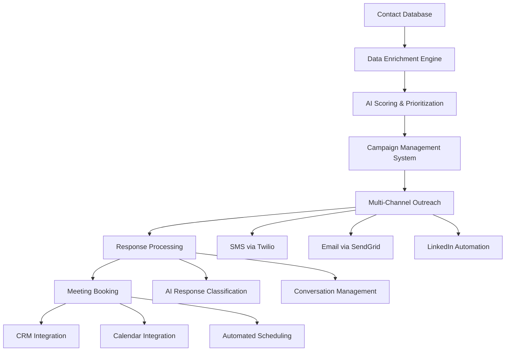

# 🔧 CINCHIT AI SALES ENGINE - TECHNICAL SPECIFICATIONS

## System Architecture Overview



---

## 🏗️ Backend Infrastructure

### Core Technology Stack
| Component | Technology | Purpose |
|-----------|------------|---------|
| **API Framework** | FastAPI 0.104+ | High-performance async REST API |
| **Database** | PostgreSQL 15+ | ACID compliance, complex queries |
| **ORM** | SQLAlchemy 2.0 | Async database operations |
| **Task Queue** | Celery + Redis | Background job processing |
| **Caching** | Redis 7+ | Performance optimization |
| **Authentication** | JWT + bcrypt | Secure API access |

### Database Schema

```sql
-- Core contact management
CREATE TABLE contacts (
    id UUID PRIMARY KEY DEFAULT gen_random_uuid(),
    external_id VARCHAR(255), -- ConnectWise ID
    company_name VARCHAR(255) NOT NULL,
    first_name VARCHAR(100),
    last_name VARCHAR(100),
    email VARCHAR(255),
    phone VARCHAR(50),
    mobile_phone VARCHAR(50),
    last_activity_date DATE,
    industry VARCHAR(100),
    employee_count INTEGER,
    annual_revenue DECIMAL,
    location VARCHAR(255),
    source_system VARCHAR(50) DEFAULT 'connectwise',
    created_at TIMESTAMP DEFAULT NOW(),
    updated_at TIMESTAMP DEFAULT NOW()
);

-- AI scoring and prioritization  
CREATE TABLE contact_scores (
    id UUID PRIMARY KEY DEFAULT gen_random_uuid(),
    contact_id UUID REFERENCES contacts(id),
    urgency_score INTEGER CHECK (urgency_score BETWEEN 1 AND 100),
    approach_angle TEXT,
    reasoning TEXT,
    confidence_level FLOAT CHECK (confidence_level BETWEEN 0 AND 1),
    signals_analyzed JSONB,
    scored_at TIMESTAMP DEFAULT NOW(),
    model_version VARCHAR(50)
);

-- Campaign management
CREATE TABLE campaigns (
    id UUID PRIMARY KEY DEFAULT gen_random_uuid(),
    name VARCHAR(255) NOT NULL,
    description TEXT,
    status VARCHAR(50) DEFAULT 'draft', -- draft, active, paused, completed
    campaign_type VARCHAR(50), -- sms, email, linkedin, multi_channel
    target_tier INTEGER, -- 1, 2, or 3
    start_date TIMESTAMP,
    end_date TIMESTAMP,
    created_by VARCHAR(255),
    created_at TIMESTAMP DEFAULT NOW()
);

-- Message templates and sequences
CREATE TABLE message_templates (
    id UUID PRIMARY KEY DEFAULT gen_random_uuid(),
    campaign_id UUID REFERENCES campaigns(id),
    template_name VARCHAR(255),
    channel VARCHAR(50), -- sms, email, linkedin
    subject VARCHAR(255),
    body TEXT NOT NULL,
    sequence_order INTEGER DEFAULT 1,
    delay_hours INTEGER DEFAULT 24,
    variables JSONB, -- {first_name, company_name, etc}
    created_at TIMESTAMP DEFAULT NOW()
);

-- Outreach tracking
CREATE TABLE outreach_messages (
    id UUID PRIMARY KEY DEFAULT gen_random_uuid(),
    contact_id UUID REFERENCES contacts(id),
    campaign_id UUID REFERENCES campaigns(id),
    template_id UUID REFERENCES message_templates(id),
    channel VARCHAR(50),
    status VARCHAR(50), -- sent, delivered, opened, responded, failed
    sent_at TIMESTAMP,
    delivered_at TIMESTAMP,
    opened_at TIMESTAMP,
    responded_at TIMESTAMP,
    message_content TEXT,
    external_message_id VARCHAR(255), -- Twilio SID, SendGrid ID, etc
    cost_cents INTEGER, -- track per-message costs
    created_at TIMESTAMP DEFAULT NOW()
);

-- Response management
CREATE TABLE responses (
    id UUID PRIMARY KEY DEFAULT gen_random_uuid(),
    outreach_message_id UUID REFERENCES outreach_messages(id),
    contact_id UUID REFERENCES contacts(id),
    response_content TEXT,
    sentiment VARCHAR(50), -- positive, negative, neutral
    intent VARCHAR(100), -- interested, not_interested, request_info, etc
    ai_classification JSONB,
    requires_human_review BOOLEAN DEFAULT FALSE,
    follow_up_action VARCHAR(100),
    responded_at TIMESTAMP DEFAULT NOW(),
    processed_at TIMESTAMP
);

-- Meeting booking
CREATE TABLE meetings (
    id UUID PRIMARY KEY DEFAULT gen_random_uuid(),
    contact_id UUID REFERENCES contacts(id),
    response_id UUID REFERENCES responses(id),
    meeting_type VARCHAR(100) DEFAULT 'it_assessment',
    scheduled_at TIMESTAMP,
    duration_minutes INTEGER DEFAULT 30,
    meeting_link VARCHAR(500),
    calendar_event_id VARCHAR(255),
    status VARCHAR(50), -- scheduled, confirmed, completed, cancelled, no_show
    notes TEXT,
    outcome VARCHAR(100), -- qualified, not_qualified, closed, follow_up_needed
    created_at TIMESTAMP DEFAULT NOW()
);

-- Business intelligence enrichment
CREATE TABLE contact_enrichment (
    id UUID PRIMARY KEY DEFAULT gen_random_uuid(),
    contact_id UUID REFERENCES contacts(id),
    enrichment_source VARCHAR(100), -- apollo, clearbit, etc
    company_data JSONB,
    contact_data JSONB,
    business_signals JSONB,
    enriched_at TIMESTAMP DEFAULT NOW(),
    confidence_score FLOAT
);
```

### API Endpoints

```python
# Contact Management
GET    /api/v1/contacts                 # List contacts with filters
POST   /api/v1/contacts                 # Import contacts
GET    /api/v1/contacts/{id}            # Get contact details
PUT    /api/v1/contacts/{id}            # Update contact
DELETE /api/v1/contacts/{id}            # Delete contact

# AI Scoring
POST   /api/v1/contacts/score           # Score contacts with AI
GET    /api/v1/contacts/{id}/score      # Get contact score
PUT    /api/v1/contacts/{id}/score      # Update score manually

# Campaign Management  
GET    /api/v1/campaigns                # List campaigns
POST   /api/v1/campaigns                # Create campaign
GET    /api/v1/campaigns/{id}           # Get campaign details
PUT    /api/v1/campaigns/{id}           # Update campaign
POST   /api/v1/campaigns/{id}/launch    # Launch campaign
POST   /api/v1/campaigns/{id}/pause     # Pause campaign

# Message Templates
GET    /api/v1/templates                # List templates
POST   /api/v1/templates                # Create template
PUT    /api/v1/templates/{id}           # Update template
POST   /api/v1/templates/{id}/test      # Send test message

# Outreach Management
POST   /api/v1/outreach/send            # Send messages
GET    /api/v1/outreach/status          # Get delivery status
POST   /api/v1/outreach/bulk            # Bulk message sending

# Response Processing
GET    /api/v1/responses                # List responses
POST   /api/v1/responses/{id}/classify  # AI classify response
POST   /api/v1/responses/{id}/reply     # Send follow-up

# Meeting Management
POST   /api/v1/meetings/book            # Book meeting
GET    /api/v1/meetings                 # List meetings
PUT    /api/v1/meetings/{id}            # Update meeting
POST   /api/v1/meetings/{id}/confirm    # Confirm meeting

# Analytics
GET    /api/v1/analytics/dashboard      # Dashboard metrics
GET    /api/v1/analytics/campaign/{id}  # Campaign performance
GET    /api/v1/analytics/roi            # ROI calculations
```

---

## 🤖 AI Integration Layer

### OpenAI GPT-4 Integration

```python
# Contact scoring prompt template
SCORING_PROMPT = """
Analyze this business contact for IT service reactivation potential.

Contact Data:
- Company: {company_name}
- Industry: {industry}  
- Size: {employee_count} employees
- Last Contact: {last_activity_date}
- Location: {location}

Business Signals:
- Recent hiring activity: {hiring_signals}
- Technology stack age: {tech_stack_age}
- Security indicators: {security_signals}
- Financial health: {financial_indicators}

Rate this prospect 1-100 for reactivation potential and provide:
1. Urgency score (1-100)
2. Primary pain points likely to resonate
3. Recommended approach angle
4. Best contact method and timing
5. Key objections to anticipate

Format as JSON:
{
  "urgency_score": 85,
  "pain_points": ["aging infrastructure", "security gaps"],
  "approach_angle": "Focus on security vulnerabilities",
  "contact_method": "SMS",
  "timing": "Tuesday morning",
  "objections": ["budget constraints", "current provider satisfaction"],
  "reasoning": "High score due to..."
}
"""

# Response classification prompt
RESPONSE_CLASSIFICATION_PROMPT = """
Classify this response to an IT services reactivation outreach:

Original Message: {original_message}
Response: {response_content}

Classify the response:
1. Sentiment: positive/negative/neutral
2. Intent: interested/not_interested/request_info/unclear
3. Urgency: high/medium/low
4. Next Action: schedule_call/send_info/follow_up_later/remove
5. Key Information: Extract any specific needs mentioned

Format as JSON with explanation.
"""
```

### AI Workflow Automation

```python
# Automated scoring pipeline
async def score_contact_batch(contact_ids: List[str]):
    for contact_id in contact_ids:
        contact = await get_contact(contact_id)
        enrichment = await enrich_contact_data(contact)
        score = await ai_score_contact(contact, enrichment)
        await save_contact_score(contact_id, score)
        
# Response processing pipeline  
async def process_response(response_id: str):
    response = await get_response(response_id)
    classification = await ai_classify_response(response)
    
    if classification.intent == "interested":
        await trigger_meeting_booking_flow(response.contact_id)
    elif classification.intent == "request_info":
        await send_information_packet(response.contact_id)
    elif classification.intent == "not_interested":
        await mark_contact_inactive(response.contact_id)
```

---

## 📱 External Service Integrations

### Twilio SMS Integration

```python
# SMS service configuration
TWILIO_CONFIG = {
    "account_sid": "AC...",
    "auth_token": "...", 
    "phone_number": "+1...",
    "messaging_service_sid": "MG...",
    "webhook_url": "https://api.cinchit.com/webhooks/twilio"
}

# SMS sending with compliance
async def send_sms(to: str, message: str, contact_id: str):
    # Check TCPA compliance
    if not await check_sms_consent(contact_id):
        raise ConsentError("No SMS consent for contact")
    
    # Rate limiting
    if await check_rate_limit(to):
        raise RateLimitError("Contact reached daily limit")
    
    # Send via Twilio
    message_result = twilio_client.messages.create(
        body=message,
        messaging_service_sid=TWILIO_CONFIG["messaging_service_sid"],
        to=to
    )
    
    # Track in database
    await log_outreach_message(
        contact_id=contact_id,
        channel="sms", 
        status="sent",
        external_id=message_result.sid,
        cost_cents=calculate_sms_cost(message)
    )
```

### SendGrid Email Integration

```python
# Email service configuration  
async def send_email(to: str, subject: str, content: str, template_id: str):
    message = Mail(
        from_email=Email("jamie@cinchit.com", "Jamie from CinchIT"),
        to_emails=to,
        subject=subject,
        html_content=content
    )
    
    # Add tracking
    message.tracking_settings = TrackingSettings(
        click_tracking=ClickTracking(enable=True),
        open_tracking=OpenTracking(enable=True)
    )
    
    # Send via SendGrid
    response = sendgrid_client.send(message)
    
    # Track delivery
    await log_outreach_message(
        contact_id=contact_id,
        channel="email",
        status="sent", 
        external_id=response.headers.get("X-Message-Id"),
        cost_cents=calculate_email_cost()
    )
```

### Apollo.io Data Enrichment

```python
# Contact enrichment service
async def enrich_contact(contact: Contact):
    apollo_data = await apollo_client.search_people({
        "first_name": contact.first_name,
        "last_name": contact.last_name,
        "organization_name": contact.company_name
    })
    
    if apollo_data["people"]:
        person = apollo_data["people"][0]
        enrichment = {
            "email": person.get("email"),
            "phone": person.get("phone"),
            "linkedin_url": person.get("linkedin_url"),
            "company_data": {
                "industry": person["organization"]["industry"],
                "size": person["organization"]["estimated_num_employees"],
                "revenue": person["organization"]["estimated_annual_revenue"],
                "technologies": person["organization"]["technologies"]
            }
        }
        
        await save_contact_enrichment(contact.id, enrichment, "apollo")
        return enrichment
```

---

## 🎨 Frontend Application

### Next.js Dashboard Architecture

```
/src/app/
├── dashboard/              # Main dashboard layout
│   ├── page.tsx           # Dashboard home
│   ├── contacts/          # Contact management
│   ├── campaigns/         # Campaign management  
│   ├── responses/         # Response handling
│   ├── meetings/          # Meeting calendar
│   └── analytics/         # Performance metrics

/src/components/
├── ui/                    # Shared UI components
├── forms/                 # Form components
├── charts/                # Analytics visualizations
└── modals/                # Modal dialogs

/src/lib/
├── api.ts                # API client functions  
├── auth.ts               # Authentication logic
├── utils.ts              # Helper functions
└── constants.ts          # App constants
```

### Key Dashboard Components

```tsx
// Main dashboard metrics
const DashboardMetrics = () => (
  <div className="grid grid-cols-1 md:grid-cols-4 gap-6">
    <MetricCard 
      title="Total Contacts" 
      value={655} 
      trend="+12%"
      icon={<Users />} 
    />
    <MetricCard 
      title="Response Rate" 
      value="8.2%" 
      trend="+2.1%"
      icon={<MessageSquare />} 
    />
    <MetricCard 
      title="Meetings Booked" 
      value={23} 
      trend="+15%"
      icon={<Calendar />} 
    />
    <MetricCard 
      title="New MRR" 
      value="$18,500" 
      trend="+$3,200"
      icon={<DollarSign />} 
    />
  </div>
);

// Contact list with filters
const ContactList = () => (
  <DataTable
    data={contacts}
    columns={contactColumns}
    filters={[
      { field: "tier", type: "select", options: ["1", "2", "3"] },
      { field: "score", type: "range", min: 1, max: 100 },
      { field: "status", type: "select", options: ["active", "responded", "meeting_booked"] }
    ]}
    actions={[
      { label: "Send SMS", action: sendBulkSMS },
      { label: "Add to Campaign", action: addToCampaign },
      { label: "Export", action: exportContacts }
    ]}
  />
);

// Campaign builder interface
const CampaignBuilder = () => (
  <div className="space-y-6">
    <CampaignSettings />
    <TargetAudience />
    <MessageSequence />
    <SchedulingOptions />
    <PreviewAndTest />
  </div>
);
```

---

## 🔒 Security & Compliance

### Data Protection
- **Encryption at rest:** AES-256 for contact PII
- **Encryption in transit:** TLS 1.3 for all API calls
- **API authentication:** JWT tokens with rotation
- **Database access:** Role-based with minimal privileges
- **Audit logging:** All contact access and modifications tracked

### TCPA Compliance Framework

```python
# Consent management
class TCPACompliance:
    @staticmethod
    async def check_sms_consent(contact_id: str) -> bool:
        """Verify SMS consent based on business relationship"""
        contact = await get_contact(contact_id)
        
        # Business relationship consent factors
        consent_indicators = [
            contact.last_activity_date is not None,  # Prior business inquiry
            contact.source_system == "connectwise",  # Came from business CRM
            not await has_opted_out(contact_id),     # No explicit opt-out
            contact.phone is not None                # Phone number provided
        ]
        
        return all(consent_indicators)
    
    @staticmethod 
    async def handle_opt_out(contact_id: str, channel: str):
        """Process opt-out request"""
        await mark_contact_opted_out(contact_id, channel)
        await cancel_pending_messages(contact_id, channel)
        await log_compliance_action("opt_out", contact_id, channel)
```

### Rate Limiting & Safety

```python
# Multi-level rate limiting
RATE_LIMITS = {
    "sms_per_contact_daily": 3,
    "sms_per_campaign_hourly": 50, 
    "email_per_contact_weekly": 5,
    "total_outreach_daily": 200
}

# Safety monitoring
async def safety_check_before_send(contact_id: str, channel: str):
    checks = [
        await check_consent(contact_id, channel),
        await check_rate_limits(contact_id, channel),
        await check_contact_blacklist(contact_id),
        await check_message_quality(message_content)
    ]
    
    if not all(checks):
        raise SafetyError("Safety check failed")
```

---

## 📊 Analytics & Reporting

### Real-Time Metrics Dashboard

```python
# Key performance indicators
class KPICalculator:
    async def calculate_dashboard_metrics(self, date_range: DateRange):
        return {
            "total_contacts": await count_contacts(),
            "contacts_scored": await count_scored_contacts(),
            "active_campaigns": await count_active_campaigns(),
            "messages_sent": await count_messages_sent(date_range),
            "responses_received": await count_responses(date_range),
            "meetings_booked": await count_meetings_booked(date_range),
            "response_rate": await calculate_response_rate(date_range),
            "meeting_rate": await calculate_meeting_rate(date_range),
            "roi": await calculate_roi(date_range)
        }
    
    async def calculate_campaign_performance(self, campaign_id: str):
        return {
            "contacts_targeted": await count_campaign_contacts(campaign_id),
            "messages_sent": await count_campaign_messages(campaign_id),
            "responses": await count_campaign_responses(campaign_id),
            "meetings": await count_campaign_meetings(campaign_id),
            "closed_deals": await count_campaign_deals(campaign_id),
            "revenue_generated": await sum_campaign_revenue(campaign_id),
            "cost_per_acquisition": await calculate_cpa(campaign_id),
            "return_on_investment": await calculate_campaign_roi(campaign_id)
        }
```

### Business Intelligence Reports

```sql
-- Weekly performance summary
SELECT 
    DATE_TRUNC('week', sent_at) as week,
    COUNT(*) as messages_sent,
    COUNT(CASE WHEN status = 'responded' THEN 1 END) as responses,
    ROUND(COUNT(CASE WHEN status = 'responded' THEN 1 END) * 100.0 / COUNT(*), 2) as response_rate,
    SUM(cost_cents) / 100.0 as total_cost
FROM outreach_messages 
WHERE sent_at >= NOW() - INTERVAL '8 weeks'
GROUP BY week
ORDER BY week;

-- Top performing message templates
SELECT 
    mt.template_name,
    COUNT(om.*) as times_sent,
    COUNT(r.*) as responses,
    ROUND(COUNT(r.*) * 100.0 / COUNT(om.*), 2) as response_rate,
    COUNT(m.*) as meetings_booked
FROM message_templates mt
LEFT JOIN outreach_messages om ON mt.id = om.template_id
LEFT JOIN responses r ON om.id = r.outreach_message_id
LEFT JOIN meetings m ON r.id = m.response_id
GROUP BY mt.id, mt.template_name
ORDER BY response_rate DESC;

-- Revenue attribution by contact source
SELECT 
    DATE_TRUNC('month', c.last_activity_date) as original_month,
    COUNT(DISTINCT c.id) as contacts,
    COUNT(DISTINCT m.id) as meetings_generated, 
    SUM(CASE WHEN m.outcome = 'closed' THEN 3500 ELSE 0 END) as estimated_revenue
FROM contacts c
LEFT JOIN meetings m ON c.id = m.contact_id
GROUP BY original_month
ORDER BY original_month;
```

---

## 🚀 Deployment & Operations

### Infrastructure Requirements

```yaml
# docker-compose.yml
version: '3.8'
services:
  api:
    image: cinchit-api:latest
    environment:
      - DATABASE_URL=postgresql://user:pass@db:5432/cinchit
      - REDIS_URL=redis://redis:6379
      - TWILIO_SID=${TWILIO_SID}
      - SENDGRID_API_KEY=${SENDGRID_API_KEY}
    depends_on:
      - db
      - redis
    
  db:
    image: postgres:15
    environment:
      - POSTGRES_DB=cinchit
      - POSTGRES_USER=cinchit_user
      - POSTGRES_PASSWORD=${DB_PASSWORD}
    volumes:
      - postgres_data:/var/lib/postgresql/data
      
  redis:
    image: redis:7-alpine
    
  worker:
    image: cinchit-api:latest
    command: celery -A app.worker worker --loglevel=info
    depends_on:
      - db
      - redis
      
  scheduler:
    image: cinchit-api:latest  
    command: celery -A app.worker beat --loglevel=info
    depends_on:
      - db
      - redis
```

### Monitoring & Alerting

```python
# Health check endpoints
@app.get("/health")
async def health_check():
    checks = {
        "database": await check_database_connection(),
        "redis": await check_redis_connection(),  
        "twilio": await check_twilio_status(),
        "sendgrid": await check_sendgrid_status(),
        "disk_space": await check_disk_space(),
        "memory": await check_memory_usage()
    }
    
    all_healthy = all(checks.values())
    status_code = 200 if all_healthy else 503
    
    return JSONResponse(
        status_code=status_code,
        content={"status": "healthy" if all_healthy else "degraded", "checks": checks}
    )

# Performance monitoring
@app.middleware("http")
async def monitor_performance(request: Request, call_next):
    start_time = time.time()
    response = await call_next(request)
    duration = time.time() - start_time
    
    # Log slow requests
    if duration > 1.0:
        logger.warning(f"Slow request: {request.url} took {duration:.2f}s")
    
    # Track metrics
    await increment_request_counter(request.url.path, response.status_code)
    await record_request_duration(request.url.path, duration)
    
    return response
```

---

## 🔧 Development Workflow

### Local Development Setup

```bash
# Backend setup
cd backend
python -m venv venv
source venv/bin/activate
pip install -r requirements.txt

# Database setup
docker run -d --name cinchit-postgres \
  -e POSTGRES_DB=cinchit \
  -e POSTGRES_USER=dev \
  -e POSTGRES_PASSWORD=devpass \
  -p 5432:5432 postgres:15

# Redis setup  
docker run -d --name cinchit-redis -p 6379:6379 redis:7-alpine

# Environment configuration
cp .env.example .env
# Edit .env with API keys

# Database migration
alembic upgrade head

# Start development server
uvicorn main:app --reload --port 8000

# Frontend setup (separate terminal)
cd frontend
npm install
cp .env.local.example .env.local
# Edit .env.local with API URLs
npm run dev
```

### Testing Strategy

```python
# Unit tests
pytest tests/unit/

# Integration tests  
pytest tests/integration/

# API tests
pytest tests/api/

# End-to-end tests
pytest tests/e2e/

# Load tests
locust -f tests/load/locustfile.py --host=http://localhost:8000
```

---

**System designed for scale, reliability, and compliance while maintaining rapid development velocity.**